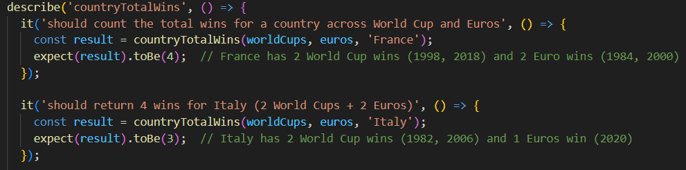
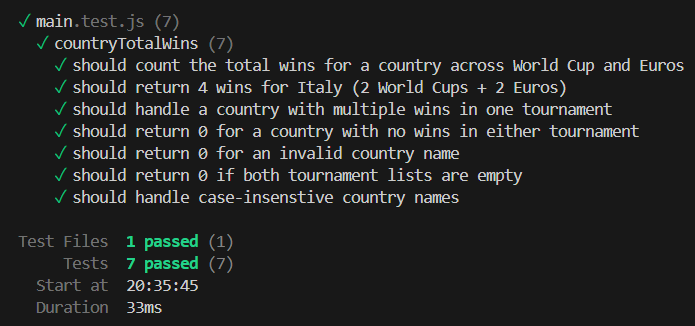
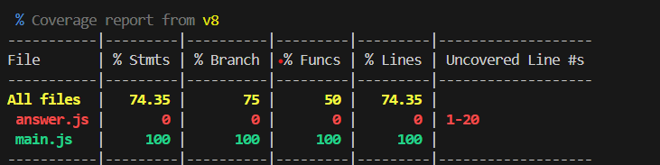

# Number of wins: World Cups/Euros

🔍 **Planning phase**

- Our team used the 💫 Disney ideation approach to brainstorm themes for our Kata, ultimately choosing sports. We identified MVP 1 requirements and removed some impractical "dreamer" options.
- We then developed several potential challenges within the sports theme and agreed which kata each team member would develop.
- Finally, we created team guidelines that outlined our collaboration methods, the check-in frequency, and our approach to troubleshooting the katas.

💻 **Implementation phase**

- I used the Three As approach from the Test-Driven Development approach to create a minimal test with the initial function setup.
- Next, I developed the function, researching methods to extract relevant data from two arrays of objects, as this was my first time working with such a task.
- Finally, with the working function, I thought about the testing cases and started to write those, using 'it' instead of 'test' as it read logically for other users.



🥷🏻 **Kata description:** 

- Create a function that calculates a country's total tournament wins across the World Cup and Euros since 1970, using the two lists below.
- If the country is included, it should return the total number of wins. You should account for the input of a country that is not listed, and also the input of a country regardless of whether it is uppercase or lowercase.

```
function countryTotalWins(worldCups, euros, country) {
    //Your code here...
}
```

```jsx
Euros
year: 1972, winner: 'West Germany'
year: 1976, winner: 'Czechoslovakia'
year: 1980, winner: 'West Germany'
year: 1984, winner: 'France'
year: 1988, winner: 'Netherlands'
year: 1992, winner: 'Denmark'
year: 1996, winner: 'Germany'
year: 2000, winner: 'France'
year: 2004, winner: 'Greece'
year: 2008, winner: 'Spain'
year: 2012, winner: 'Spain'
year: 2016, winner: 'Portugal'
year: 2020, winner: 'Italy'
year: 2024, winner: 'Spain'

World Cup
year: 1970, winner: 'Brazil'
year: 1974, winner: 'West Germany'
year: 1978, winner: 'Argentina'
year: 1982, winner: 'Italy'
year: 1986, winner: 'Argentina'
year: 1990, winner: 'West Germany'
year: 1994, winner: 'Brazil'
year: 1998, winner: 'France'
year: 2002, winner: 'Brazil'
year: 2006, winner: 'Italy'
year: 2010, winner: 'Spain'
year: 2014, winner: 'Germany'
year: 2018, winner: 'France'
year: 2022, winner: 'Argentina' 
```

🧪 **Testing approaches**

I tested for the following:

- The country input is not in sentence case - user will need to use the ‘toLowercase’ in the code.
- The country input has not won any of the tournaments - e.g. England.
- The country has won titles in both tournaments - to ensure accessing both arrays.
- The country has only won one of the tournaments.
- The arrays are empty (missing the tournament data).
- The country is an invalid name - e.g. Testland.

It was very satisfying to needle out the issues on the tests and get them to pass 🎉


I also ran test coverage:



💪🏻**Issues I came up against**

- While creating both the code and tests from scratch, I discovered inconsistencies between the arrays in both files that prevented all tests from passing.
- One issue arose from extra whitespace in an array object, which affected the win count calculation.
- I explored various methods to extract and count wins from both arrays. Learning about 'reduce()' and 'filter'—along with other approaches—gave me confidence that users could solve this problem through different valid solutions.

⏭️ **Next:**

- To  increase the difficult of the kata, you could look to:
1. Add more tournaments - like the Copa América.
2. Add in the runner-up as well as the winner of a particular tournament
